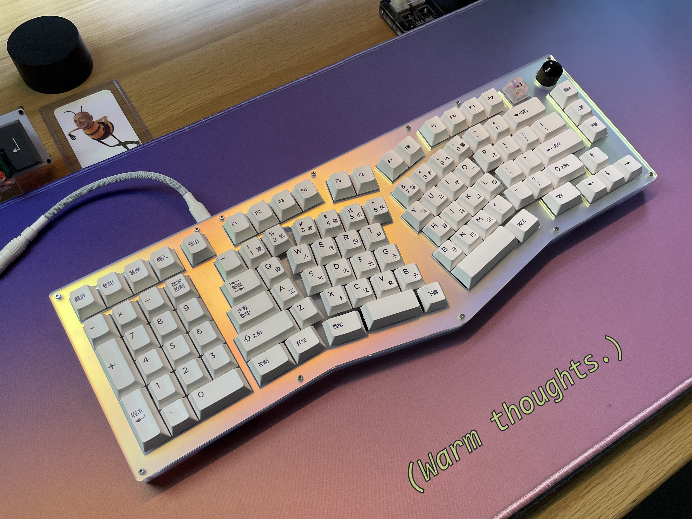

# Louise

A project between Josh and RiotPunch to build a 75% alice keyboard with a southpaw numpad.

All the PCB files, case dxfs, and QMK firmware required to build your own are located in this repo.

Thanks to [Warmthoughts](https://www.twitch.tv/warmthoughts) for the photo.

## BOM

| Type     | Spec         | Quantity | Notes                                            |
|----------|--------------|----------|--------------------------------------------------|
| Standoff | M2 x 5mm     | 2        | Wrist Wrest                                      |
| Standoff | M2 x 8mm     | 5        | Foot                                             |
| Standoff | M2 x 10mm    | 3        | Wrist Wrest                                      |
| Standoff | M2 x 12mm    | 12       | Case                                             |
| Screw    | M2 x 5mm     | 4        | Wrist Wrest                                      |
| Screw    | M2 x 6mm     | 40       | Everywhere                                       |
| Encoder  | EC11, 15mm   | 1        | PEC11R-4215F-S0024                               |
| Knob     | Max Dia 18mm | 1        | https://www.aliexpress.com/item/33000897896.html |
